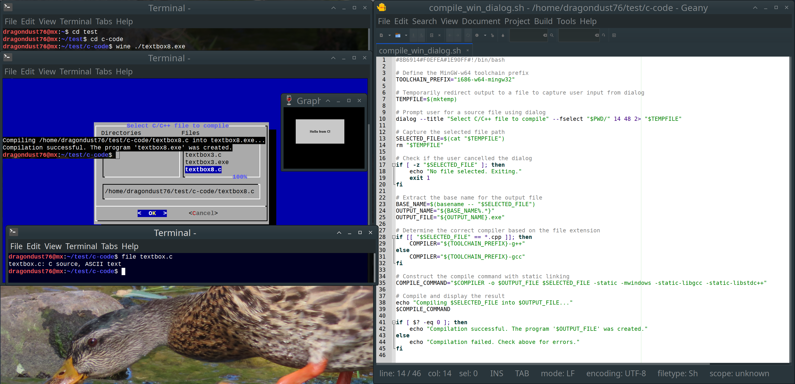

# cross-compilation
Scripts to compile C source code into Windows Portable executables

compile_win_dialog2.sh - a bash script to select a C source file from a dialog box to be compiled as Windows Portable Executable
*must have mingw-w64 package and dependencies installed (as usual for compiling C source to Win32_PE's)
*navigate the dialog box with TAB button and use SPACE button to select file
~~Thanks! 

